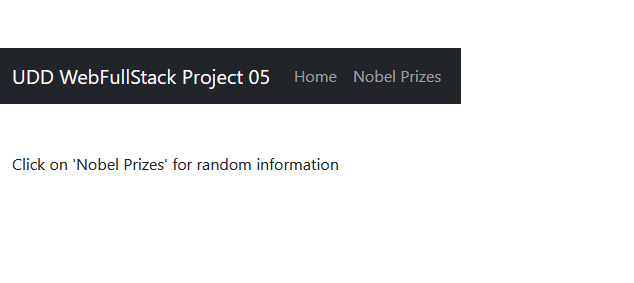
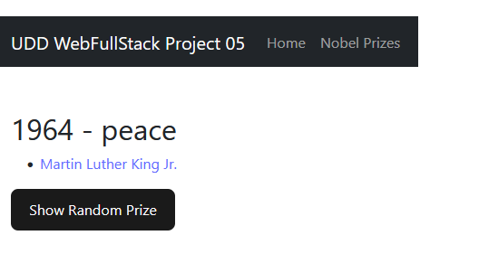
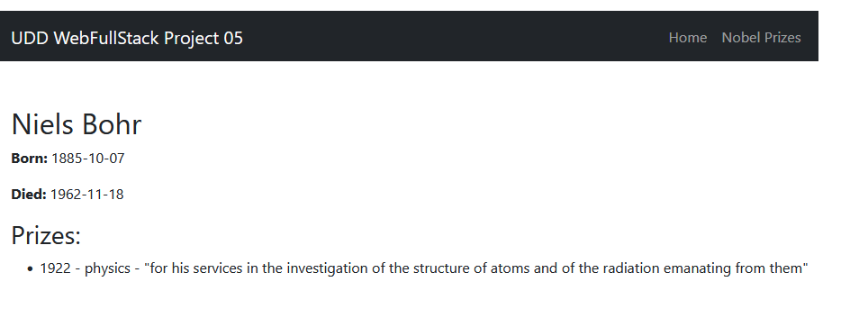

**\[UDD\] Desarrollo Web Fullstack C13**

# Proyecto 05: Aplicación Web con React

## Tabla de Contenidos

- [1. Descripción](#1-descripci%C3%B3n)
- [2. Desarrollo](#2-desarrollo)
    - [2.1 API NobelPrize.org](#21-api-nobelprizeorg)
    - [2.2 Método Laureate](#22-m%C3%A9todo-laureate)
    - [2.3 Creación de Proyecto](#23-creaci%C3%B3n-de-proyecto)
- [3. Pruebas](#3-pruebas)
- [4. Conclusión](#4-conclusi%C3%B3n)
- [5. Referencias](#5-referencias)

## 1. Descripción
El proyecto consiste en crear una aplicación web con React que consumirá datos de una API pública. Los datos obtenidos se mostrarán en una interfaz de usuario.

## 2. Desarrollo 

### 2.1 API `NobelPrize.org`
La API utilizada para consumir es sobre *Premios Nobel*. La documentación sobre como obtener los datos necesarios se encuentra en el siguiente link: <https://nobelprize.readme.io/reference/laureate>

### 2.2 Método `Laureate`
el método `Laureate` entrega un archivo .json con toda la información disponible sobre las personas que han recibido el premio nobel. El link correspondiente es: <https://api.nobelprize.org/v1/laureate.json>

Sin embargo, para poder utilizarlo en la instrucción `fetch()`, se ingresará como consulta por id:

```jsx
fetch(`https://api.nobelprize.org/v1/laureate.json?id=${id}`)
```

### 2.3 Creación de Proyecto
Se realizan los siguientes pasos para la creación del proyecto:

1. Creación proyecto `premios-nobel`
```sh
npm create vite@latest premios-nobel --template react
```

2. Instalar dependencias
```sh
cd premios-nobel
npm install
```

3. Instalar React Router
```sh
npm install react-router-dom
```

4. Instalar bootstrap
```sh
npm --save bootstrap
```

5. Establecer jerarquía de archivos
```
premios-nobel/
├── public/
├── src/
│   ├── components/
│   │   ├── NobelList.jsx
│   │   ├── NobelDetail.jsx
│   │   ├── Header.jsx
│   ├── App.jsx
│   ├── main.jsx
│   ├── index.css
├── package.json
├── vite.config.js
```

6. Crear componentes según jerarquía de archivos: `Header.jsx`, `NobelList.jsx`, `NobelDetail.jsc`, 

## 3. Pruebas
Se intentó utilizar 'Github Pages' para publicar el proyecto. Sin embargo, surgieron errores y la página se veía en blanco. Se listan los pasos intentados:

1. Crear repositorio `premios-nobel`

2. Instalar paquete `gh-pages`
```sh
npm install gh-pages --save-dev
```

3. Agregar instrucción en `vite.config.js`

```jsx
base: '/premios-nobel',
```

4. Agregar scripts de publicación en `package.json`

```sh
"predeploy": "npm run build",
"deploy": "gh-pages -d dist",
```

5. Agregar `home` en `package.json`
```sh
"homepage": "https://sauk1346.github.io/premios-nobel/",
```

6. Publicar proyecto
```sh
npm run build
npm run deploy
```

Dado a que solo se ve una página en blanco, Se restaura a una versión anterior a estos pasos para poder visualizar la aplicación web. Se realizan pruebas locales:

1. Página principal


2. Elección aleatoria de id en API


3. Información detallada sobre id seleccionada


## 4. Conclusión
Este proyecto permitió comprender la biblioteca React y su uso para la creación de aplicaciones web interactivas y rápidas, así como su uso para realizar cambios de estado de manera automática al actualizar la interfaz de usuario.

Además se mantiene en práctica las clases vistas en módulos anteriores, como el método de consultas para protocolo HTTP, la estructura DOM de HTML para poder aplicar correctamente el 'Virtual DOM', y uso de frameworks para diseño como Bootstrap. 

## 5. Referencias
- UDD BootCamp Web FullStack, Clases 17 a 20, Profesor [Matías Molina Aguilar](https://cl.linkedin.com/in/matiasmolinaaguilar)

- DeivChoi@Youtube: [Aprende React en 45 Minutos](https://www.youtube.com/watch?v=PWF5SgnNdp4)

- CodewithBeto@Youtube: [Tutorial React hooks](https://www.youtube.com/watch?v=jaLl4ErmU44)

- W3Tutorials : [React Tutorial](https://www.w3schools.com/react/)

- FixterGeek@Youtube: [Cómo subit tu proyecto Vite a Github Pages](https://www.youtube.com/watch?v=ZI7MXe-6HzA)